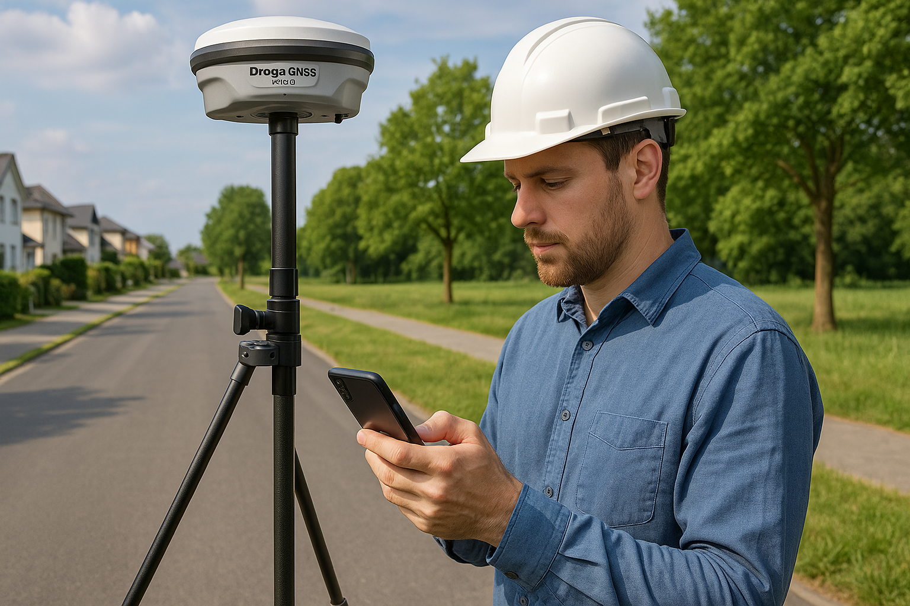
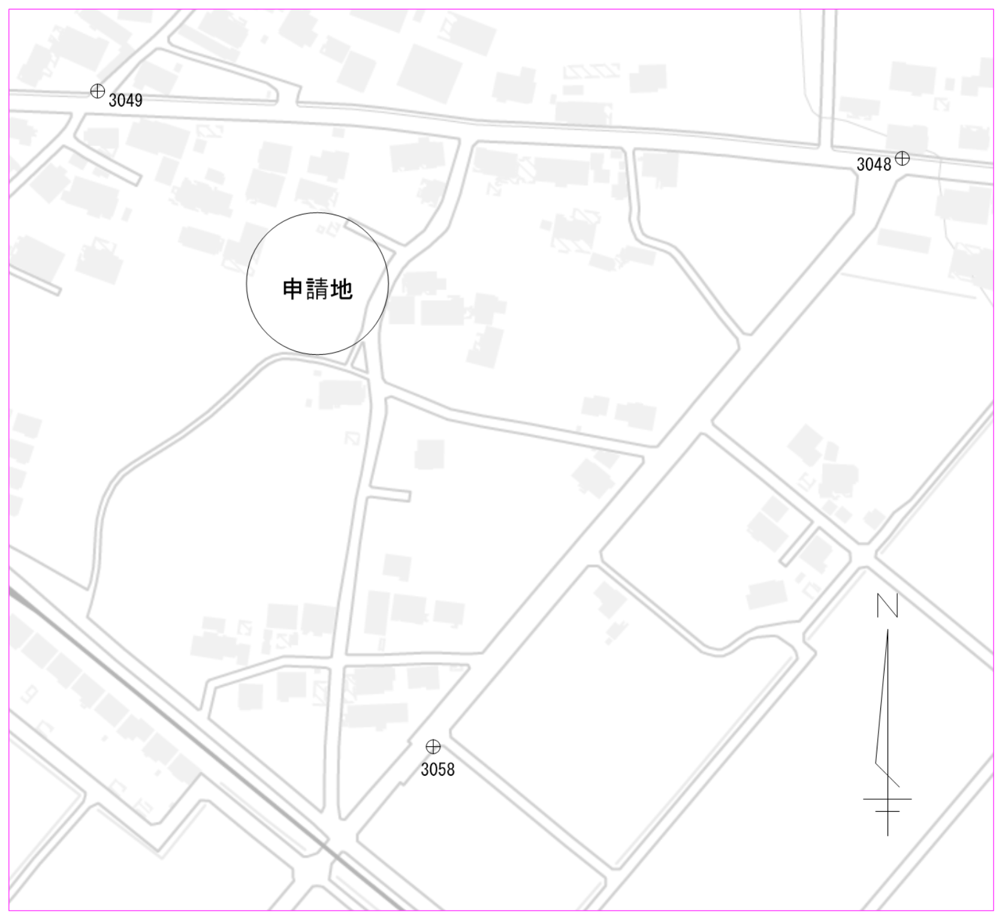
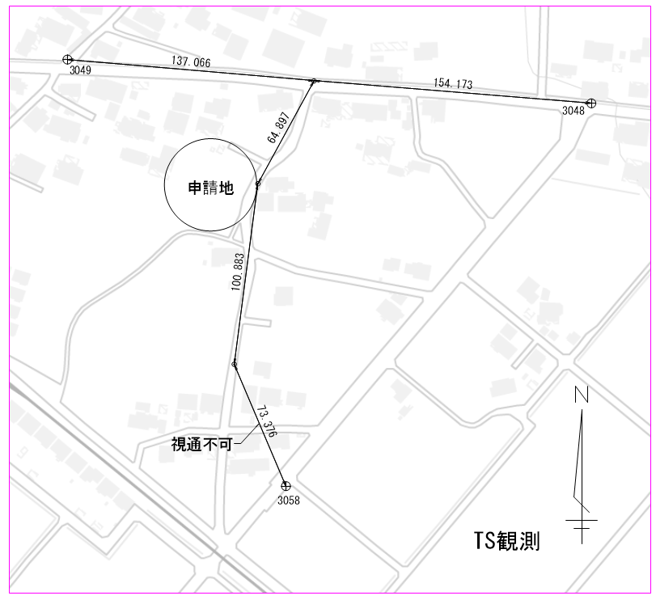
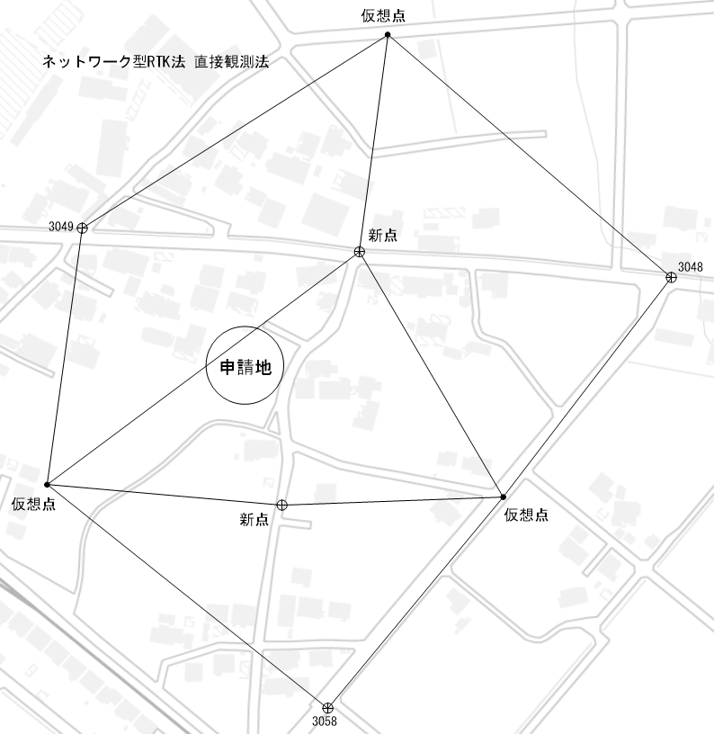
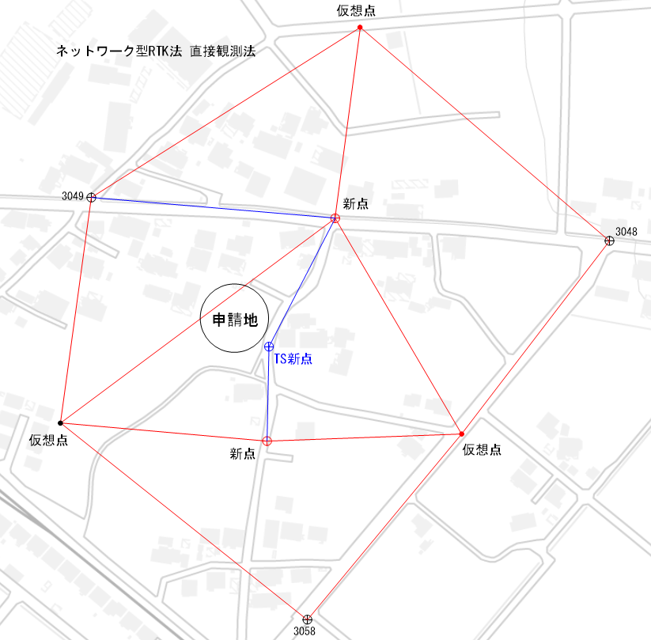
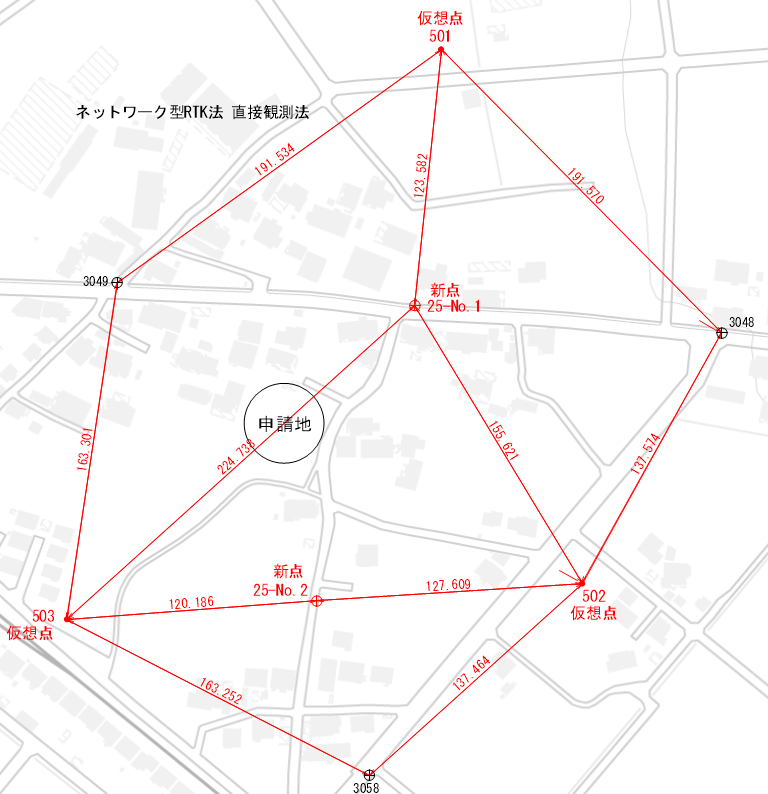
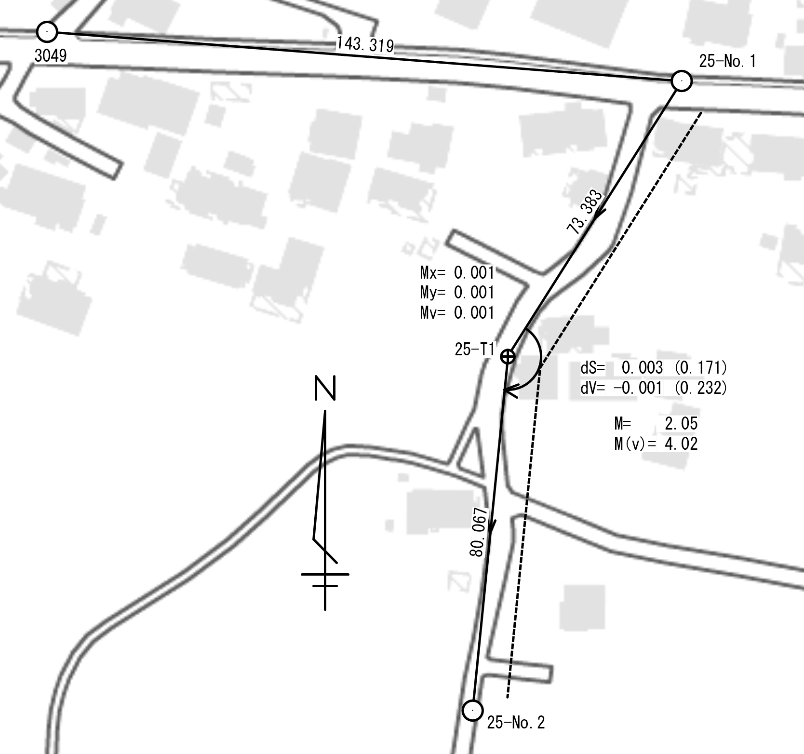
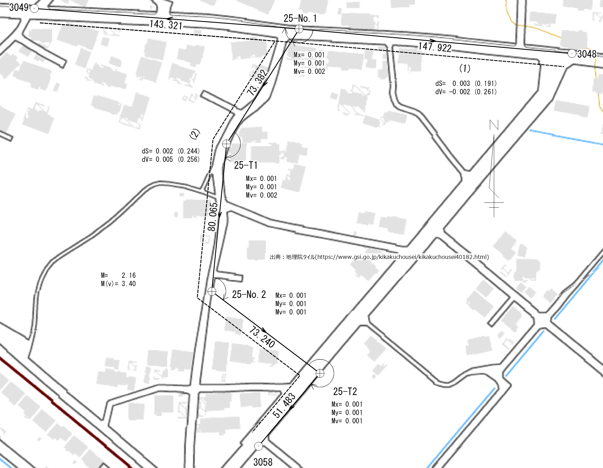
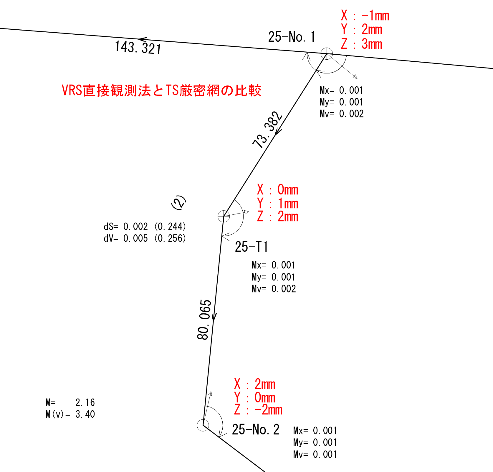
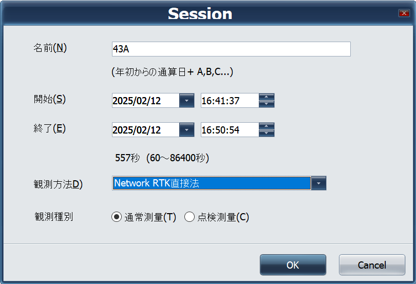

# 課題設定
申請地の前面に基準点を設置したいとする。
## 申請地の周辺の様子
申請地周囲には**3点の3級基準点**がある。

## TS観測の場合
- 観測距離が長く、観測コストが高い
- 点間距離を真面目にとると、さらに新点の数が多くなる
- **建物があり、視通不可な箇所がある**
	- 迂回するためにはさらに観測量が増え、路線の形も悪くなる（観測例は後述）

## VRS直接観測法を検討する

- **GNSS観測では、点間の視通が取れなくても観測が可能**
	- 代わりに上空視界の確保やマルチパスの考慮が必要
### VRS直接観測法の観測計画で気を付けたこと
- 基準点測量後の境界測量では、器械点と後視点で**最低2点の基準点が必要**であり、**最低でも1か所は、TS観測における視通を確保しなくてはならない**
	- 点検や将来的なことを考えると、視通確保できる点は3点以上あると、より良い

## VRSとTSを両方使おう
- **観測計画を立てる中で、VRSとTSを組み合わせれば良いと気づく**
- 以下のような事情もあるため、**GNSSとTS観測を併用することにした**
	- TS観測のみと比べて観測量が少ない
	- GNSS観測のみと比べて選点がしやすい
		- 上空視界が悪い場所をTSでカバーできる
		- **申請地の前面道路は建物に囲まれていて上空視界が良くない**
	- GNSSとTSで、それぞれの網を適切に計画できる
		- 申請地の前にGNSS観測点を設置すると点間距離が不ぞろいになり、新点位置精度に影響するおそれがある
	- **VRS新点をTS観測で点検することにもなり、後工程に安心感が増す**
	

# 先に結果から
## VRS直接観測法の結果

- 水平位置の標準偏差は**最大で6mm**
- **点間距離は120m程度なので問題はなさそう**
- 適切に観測したとても、VRS直接法では良くてこのくらいの標準偏差だと思われる
	- 間接観測法だともう少し難しくなるはず
- 点間距離を適切に取ることが、高精度を得るうえでは重要そう
	- 距離長め、できるだけ等間隔が良さそう
- GNSS測位は（TSに比べても）長距離観測に強いので、点間距離は遠いほうが有利
- **VRSでTS並みの位置精度を出すためには観測計画が大事！**

## 新点位置の標準偏差の詳細
計算はDrogger Processorによる

## TS単路線網
- 上記のVRS直接観測法の結果を与点として、TSの単路線網でつなげた結果
- **閉合差は1/50000**

## 【参考】TSだけの場合と比較する
- 今回は直接観測法を採用するのが初めてなこともあり、点検のため、全点に対してTSで対回観測した
	- これまでの何度かテストはしたが、実戦投入は初めて
	- ここまでの点検は**今回だけ**にする（毎回やってると直接観測法の意味がなくなる）
### 点検路線の閉合差と新点座標位置標準偏差
**TS観測だけでも問題が無いことが確認できた**

## 比較考察
	
- 今回の結果において、**TSだけの場合とVRS+TSの結果には差がほぼ無いと評価できる**
	
- 点間距離が70mで座標差が2mmであれば、TSで後視観測した時の水平角の差は約6.55"
	- $arcsin(2/70000)*60*60=0.0018...*3600=6.548...$
		- 参考: 2級Aトータルステーションの測角精度は5"
	
- 今回、申請地の境界測量に使いたいのは**25-T1**だけ
	- 25-No.1および25-No.2は後視点としての利用となる

## 仮に
### 25-No.1と25-No.2をスタティックでやった場合
- GNSS機器と三脚が複数台必要
	- 三脚を設置する手間がある
- 2セット観測必要だから60分×2セット
	- 点検は異なるセッションの環閉合か重複基線の較差による
- 長時間観測なため、場合によっては、三脚の近くに保安員の配置（無理

### VRS基準点測量なら
- GNSS機器が1台で済む
- ひとりでできる
- 今回の観測時間は**45分程度**
	- 既知点が3点、新点が2点
	- 上記に選点や埋標は除く
- 一点の観測につき慎重に60エポック取っているから、作業規定の最低ラインである10エポックであれば、さらに短時間にもなる
	- 結果に差が出るかは要検証
	- 観測環境によっては差が出そう

# 観測について

## 使用機器・ソフトウェア

### 機材
- GNSS
	- Drogger RZX.D
		- RZX.DはRWXに比べて観測値のバラつきが少ない
- GNSSアクセサリ
	- RTKポール
	- バイポッド
	- 方位磁石
	- カメラ用クランプ
		- RTKポールにコントローラーなどを固定する
- コントローラー
	- Androidスマートフォン
- インターネット通信
	- povo 2.0
	- 無課金でも大丈夫だと思うが、念のためチャージした
#### ソフトウェア
- Drogger GPS（Android）
- Drogger Processor（WindowsPC）

## 観測準備

### DroggerGPS設定
#### 使用衛星
- GPS
- QZSS
- GLONASS
- Galileo
- **BeiDouはオフ**
- RZS.DまたはRZX.Dの場合、Frequencyは"有効"
#### 更新・計測レート
- **1Hz**
	- 作業規程の通り
#### RTK
- **移動用キャスターホスト**に契約情報を入力
	- Ntrip Casterタイプ`Terasat Japan`
	- マウントポイント`VRS_RTCM32(GAL)
	- [DG-PRO1RWS 日本テラサット ネットワーク型GNSSデータサービスを使う - Beyond your wall with Drogger](https://drogger.hatenadiary.jp/entry/terasat)

> [!faq] マウントポイントについてテラサットサポートに問い合わせた回答
>**Q.**
>Droggerを使用している場合に、『どのマウントポイントを使用すればいいか』
>
>**A.**
>業務上、Galileo衛星を使用してはいけない場合を除いて、5001番ポートの**VRS_RTCM32(GAL)** を選択してください。
>計算に使用出来る衛星が5,6機増えますので、FIXしやすくなると思います。
>回答日時：2023-06-02

#### 指定した位置を送信する
- ここで**仮想点**の設定をする
- **観測中にセッションを切り替えるたび、仮想点も切り変える**
- 仮想点は通常、あらかじめ測量CADなどで作成して、DroggerGPSにインポートしたWaypointから選択する

#### 座標系と表示
- 「平面直角座標」「9系」「"日本のジオイドを使う"をON」

### 参考
- [Drogger Processor RTK法・ネットワーク型RTK法 測量 - Beyond your wall with Drogger](https://drogger.hatenadiary.jp/processor_rtk)

## 観測手順
1. Drogger機器の電源を入れる
2. 観測用の設定ファイルを読み込む
	- 最初（Aセッション）に使う仮想点の指定をする
3. `Session Settings`の設定をする
4. DroggerGPSとDroggerを接続する
5. FIXしたら観測する(Aセッション)
6. Aセッションが完了したらDroggerとの接続を切り、**仮想点とセッション**をBセッションで使うものに切り替える
7. 再び接続し、FIXしたら観測する（Bセッション）
8. Bセッションが完了したらDroggerとの接続を切り、**仮想点とセッション**をCセッションで使うものに切り替える
9. 再び接続し、FIXしたら観測する（Cセッション）

### GNSS機器の設置
- RTKポールの高さは**2.000m**とした
	- ポールの高さや設置は、すべての観測を通して**変えないようにする**
	- 途中で高さを変えると観測精度悪化のもと
- 方位磁石を使って、アンテナの向きを常に同じ方向（通常は北）に向ける
	- 気泡管は観測の直前や前日にTSで確認しておくと良い
	- 気泡管誤差やRTKポールの曲がりによる影響を減らす

### Session Settingsの例
- スクリーンショット用に**思い出しながら設定し直したもの**
>注1 受信機がRZX.Dの場合は、国土地理院 1級GNSS測量機の登録がRZS.Dですので「受信機」は「RZS.D」を選択してください。
- [Drogger Processor RTK法・ネットワーク型RTK法 測量 - Beyond your wall with Drogger](https://drogger.hatenadiary.jp/processor_rtk#%E3%82%BB%E3%83%83%E3%82%B7%E3%83%A7%E3%83%B3%E3%81%AE%E8%A8%AD%E5%AE%9A)

### 観測時の注意点
- スタティック法などと異なり、現地で即時に解析をするため、**後から観測条件等の変更ができない。**
	- 設定等を間違えた場合は再測となる
> [!quote]
> 移動局でＧＮＳＳ衛星からの信号を受信し、移動局側において即時に解析処理を行って位置を求める。
- [作業規程の準則（全文）［PDF 1.90MB］_000258734, ページ 21](作業規程の準則（全文）［PDF%201.90MB］_000258734.pdf#page=21&selection=21,17,22,19)

- 設置したあとは、すぐに観測を始めないほうが値が安定しそう
	- 設置したら、石突や気泡がズレていないかを、落ち着いて確認してから記録を始めるくらいで良さそう
	
- セッションの切り替え時に、仮想点だけでなく、**セッションのインクリメント（+1）** を忘れがちなので注意
	
-　同一の測点の点番号と点名は、セッションが違っても同じ点名と点番にする
	- 点名の横にある検索アイコンを押すと、過去のWayPointから近い点名と点番が自動で入るので便利
	
	- **点番と点名を間違えてしまっても、手簿出力の前に修正すれば大丈夫**（だと思う
		- 再測までしなくても良い（はず
	
- 観測後の標準偏差が悪い時など、一点につき複数回観測しても、あとから手簿を整理すれば大丈夫そう
	- 一方で観測が長引くほど、衛星配置などが変化し、精度的には良くない

# 処理手順
## DroggerGPSからデータの出力
1. 点番や点名等を確認して、必要なら修正する
2. 観測手簿と観測記簿を確認する
3. PCに`.gpx`ファイルを転送する
## DroggerProcessor
1. プロジェクトの作成
	- 「ジオイド2024 日本とその周辺」
	- 平面直角座標「9系」
	- 必要に応じてプロジェクトオプションを設定
2. データのインポート
	- DroggerGPSから転送したファイルをドラッグ&ドロップ
	- 観測方法は「Network RTK直接法」を選択
	
3. 既知点座標の入力
	1. "セッション"を選択
	2. "点と観測データ"から既知点名を**右クリック**
	3. "固定点"をクリック
	4. もう一度既知点名を**右クリック**して座標をクリック
	5. 成果表などを見ながら座標を入力する
		- 既知点の成果表と最新ジオイドモデルから求めたジオイド高を足した楕円体高を入力する
		- [測量技術に関するQ&A のQ4](https://www.jsurvey.jp/gijyutsuq&a.htm)
			- > 公共基準点は成果表の標高とジオイド高（国土地理院が提供する最新ジオイドモデル）から楕円体高を求め、与件として三次元網平均計算を行ってください。
		- でもDroggerProcessorなら、既知点成果の標高を入れれば自動で楕円体高にしてくれている（ようだ
		- つまりDroggerProcessorなら、毎回ジオイド高を調べなくて良い
			- 一応、[地理院のサイト](https://vldb.gsi.go.jp/sokuchi/surveycalc/geoid/calcgh/calcframe.html)で確認はした方が良い
		
4. 同じように、すべての既知点に座標を入力する
5. 観測手簿や観測記簿のチェック
6. 点検
7. 仮定網平均計算
	- 水平位置チェック
8. 実用網平均計算

- 仮定網と実用網は元期座標で行う

# 補足

## GNSS観測に適した場所
- 障害物の少ない場所
	- 田畑
	- 農村
	- 市街地の外れの方
## 危ない場所では最初からやめておこう
- 障害物の多い場所
	- 駅前
	- 市街地
	- DID地区
- ➡**GNSSを積極的に使って経験値を貯めよう！**
	- 判断基準は、経験によるところが結構ある

## VRSの観測計画では、それなりに衛星の飛来状況を見る
- スタティックの場合は長時間観測なので、綿密な計画を立てることが多い
	- スタティックありきで考えることが多く、時間調整がしやすい
- VRSは短時間観測なので、衛星配置の影響を受けやすいと思われる
	- それほど厳密に見なくても良いが、可能な限りで、衛星が多く飛ぶ時間を選ぼう
- VRSはスタティックと違い、あとから衛星の選択などができない
	- スタティックはRAWデータゆえのバッファがある
	- 観測データ量が少ないVRSでは、**特に観測計画が重要**

# 資料
## Drogger公式
- [Drogger Processor RTK法・ネットワークRTK法 対応 - Beyond your wall with Drogger](https://drogger.hatenadiary.jp/entry/2022/12/15/123402)
- [Drogger Processor RTK法・ネットワーク型RTK法 測量 - Beyond your wall with Drogger](https://drogger.hatenadiary.jp/processor_rtk)
## VRS直接観測法の実証例
- [RTK直接法検証実験](https://www.koi-s.jp/tech/t_gns02-1.html)
